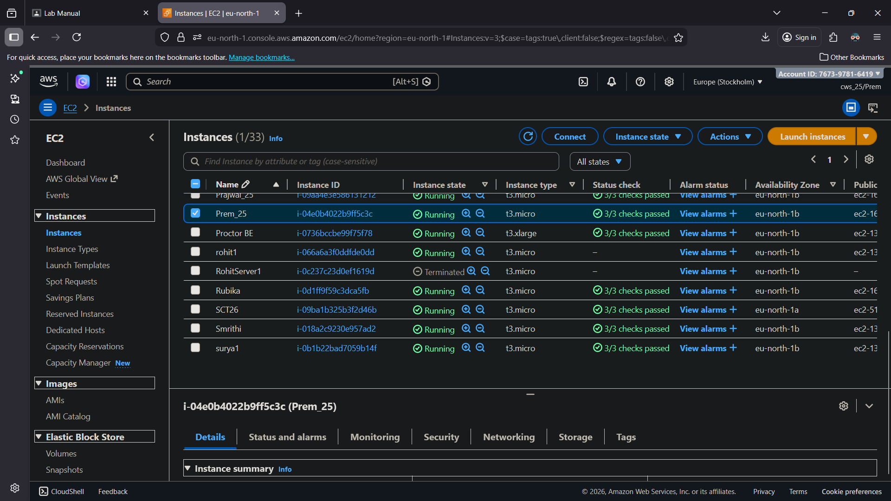
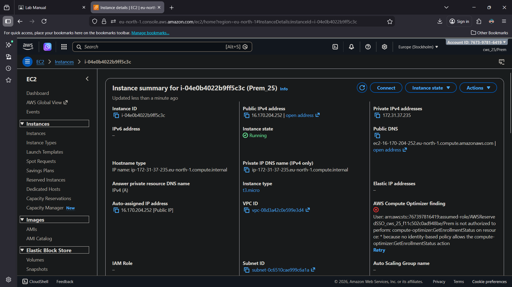
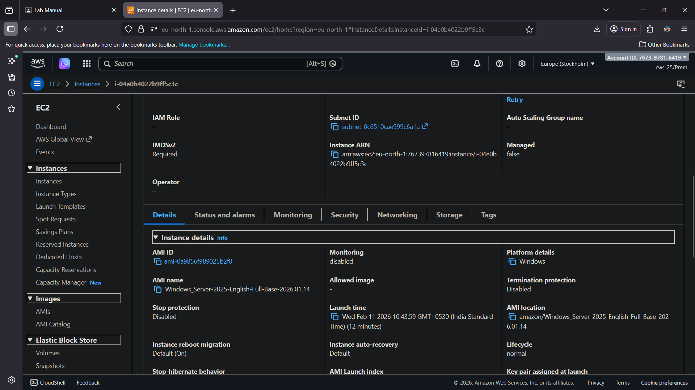
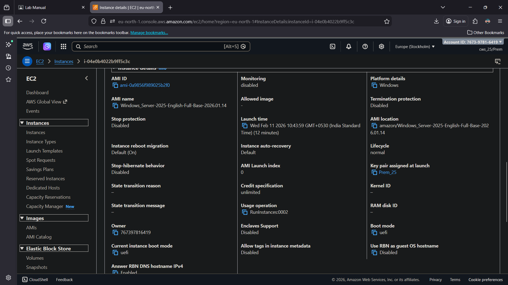
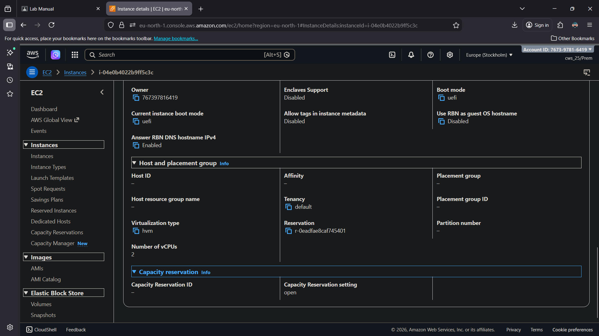
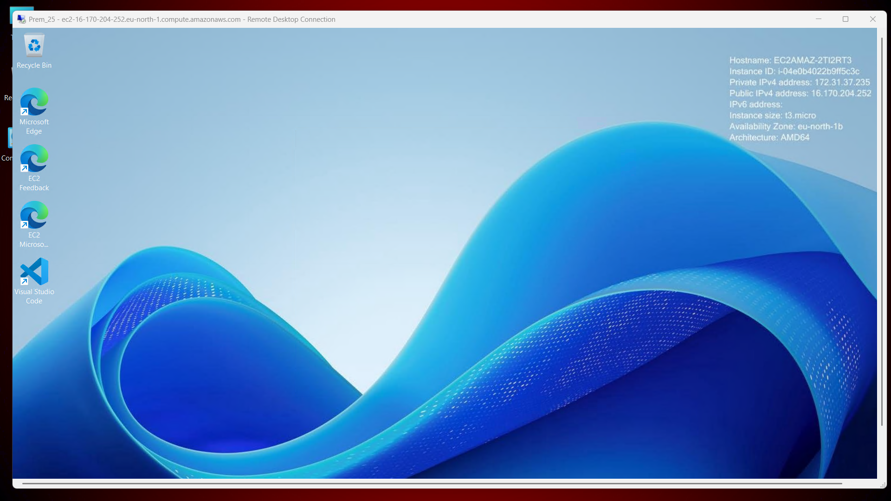
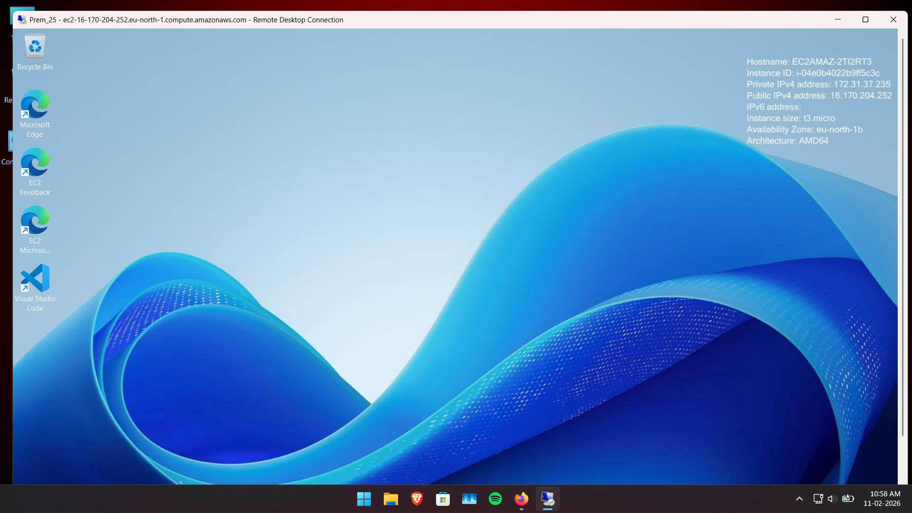
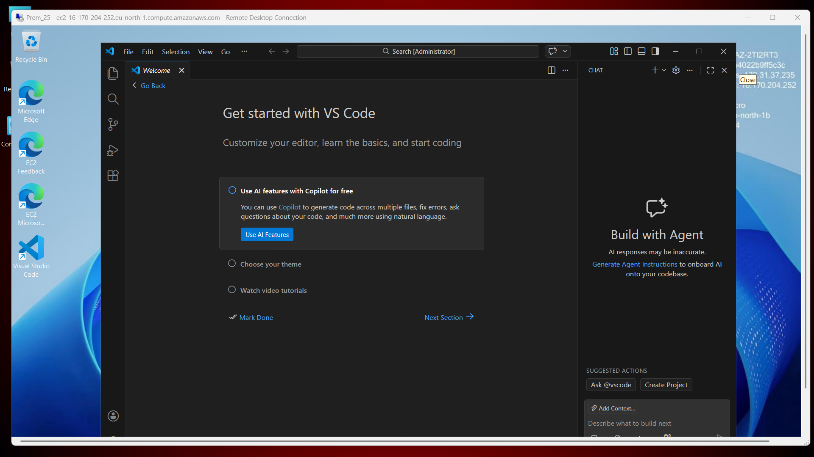
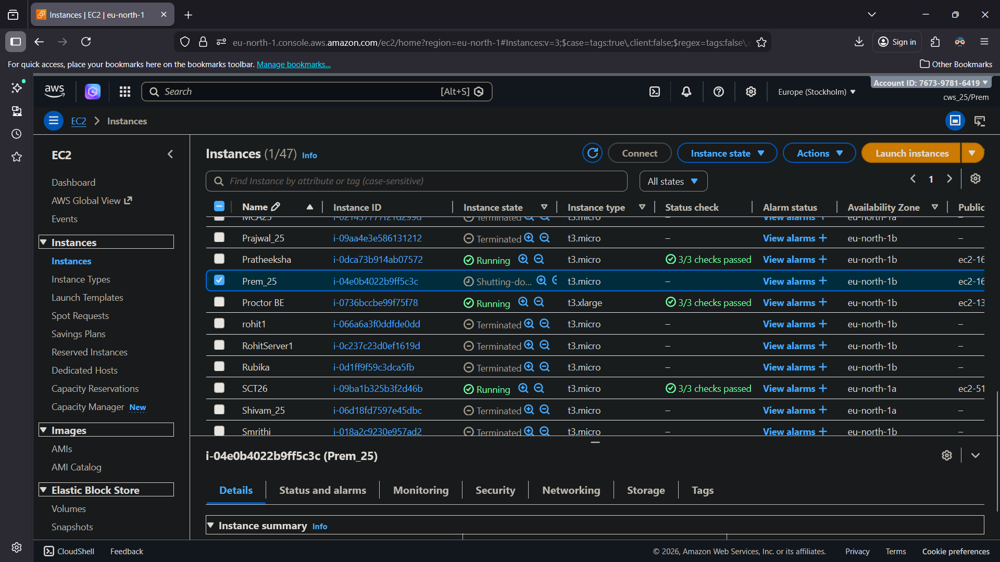

# Experiment: Creation of a Windows EC2 Instance and Installing VS Code via User Data

## Aim

To launch a Windows Server EC2 instance and use the **User Data** field to automatically install Visual Studio Code at boot time, without manual software installation after connecting.

## Requirements

- AWS Account
- IAM User with EC2 permissions
- VPC with a public subnet
- Security Group allowing RDP (Port 3389)
- Windows key pair (.pem) to decrypt the administrator password
- An RDP client (e.g., Remote Desktop Connection)

## Theory

**User Data** is a script that EC2 passes to an instance at first boot. On Windows AMIs, EC2Launch/EC2Launch v2 executes User Data written as PowerShell (wrapped in `<powershell>` tags) using the `SYSTEM` account, before the instance is fully available for login. This lets an instance install software, configure settings, or fetch files automatically the moment it starts — removing the need to manually log in and install applications.

---

## Procedure

### Step 1: Launch a Windows EC2 Instance

- Open the AWS Management Console → **EC2 → Instances**.
- Click **Launch Instances**.
- Enter a name for the instance (e.g., `Prem_25`).
- Under **Application and OS Images (AMI)**, select a Windows AMI (e.g., `Windows_Server-2025-English-Full-Base`).
- Choose the instance type: `t3.micro`.
- Select or create a key pair (e.g., `Prem_25`) — this is required to decrypt the Windows administrator password later.
- Under **Network settings**, select the VPC/subnet and a Security Group that allows:
  - RDP (Port 3389) — restrict the source to your IP for security.

### Step 2: Add the User Data Script

- Expand **Advanced details** at the bottom of the Launch Instance page.
- Scroll to the **User data** field.
- Paste a PowerShell script wrapped in `<powershell>` tags so it runs automatically on first boot. Example script to silently install VS Code:

```powershell
<powershell>
# Download the VS Code system installer
$installerPath = "$env:TEMP\vscode-installer.exe"
Invoke-WebRequest -Uri "https://update.code.visualstudio.com/latest/win32-x64/stable" -OutFile $installerPath

# Silent install with desktop icon and PATH registration
Start-Process -FilePath $installerPath -ArgumentList "/verysilent /mergetasks=!runcode,addcontextmenufiles,addcontextmenufolders,addtopath" -Wait

# Clean up the installer
Remove-Item $installerPath -Force
</powershell>
```

- Click **Launch Instance**.

### Step 3: Wait for the Instance to Reach Running State

- Navigate to **EC2 → Instances**.
- Wait until the instance status shows **Running** and status checks pass (this can take a few minutes longer than usual since the User Data script needs to finish installing VS Code in the background).

**Reference — Instance running in the EC2 console:**



**Reference — Instance summary showing public/private IP and running state:**



### Step 4: Verify Instance Details

- Open the instance details page and check the **AMI ID**, **AMI name**, and **platform details** to confirm the correct Windows image was used.

**Reference — AMI details confirming the Windows Server base image:**



- Confirm the key pair assigned at launch matches the one used to decrypt the password.

**Reference — Key pair assigned at launch:**



- Optionally check host/placement details (vCPUs, virtualization type, tenancy) under the instance details page.

**Reference — Host and placement / vCPU details:**



### Step 5: Get the Windows Password and Connect via RDP

- Select the instance → **Connect → RDP client** tab.
- Click **Get password**, upload the `.pem` key file, and decrypt the administrator password.
- Open **Remote Desktop Connection**, enter the instance's Public IPv4 DNS/IP, and log in using the Administrator username and decrypted password.

### Step 6: Verify the Instance Metadata on the Desktop

- Once connected, the Windows desktop background displays the instance metadata (Hostname, Instance ID, Private/Public IPv4 address, Instance size, Availability Zone, Architecture) — confirming a successful RDP session into the correct instance.

**Reference — RDP session showing instance metadata on the desktop:**



**Reference — Desktop taskbar confirming an active, responsive Windows session:**



### Step 7: Verify VS Code Was Installed via User Data

- Locate the **Visual Studio Code** shortcut on the desktop (created by the installer without any manual installation step).
- Launch VS Code and confirm it opens successfully with the default **Welcome** screen — proving the User Data script executed and installed the application automatically at boot.

**Reference — VS Code launched successfully, installed automatically via User Data:**



### Step 8: Clean Up

- Once verification is complete, terminate the instance to avoid ongoing charges.
- Navigate to **EC2 → Instances**, select the instance, and choose **Instance state → Terminate instance**.

**Reference — Instance shutting down after termination:**



## Expected Output

- A Windows EC2 instance launches successfully using the specified AMI and key pair.
- The User Data PowerShell script executes automatically at first boot.
- Visual Studio Code is installed on the instance without any manual installation step, and is verified by connecting via RDP.
